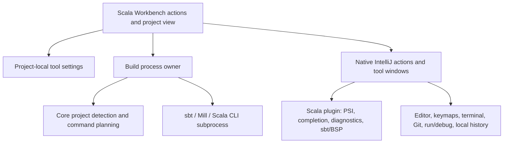

# Service boundaries

`core` has no IntelliJ types and does no process execution. Project detection
inspects root markers and at most 64 BSP connection names. It does not execute
or parse build scripts, traverse source trees, or equate detection with import.
Command plans contain an immutable working directory and argument list.

`workbench` adapts those policies to IntelliJ. UI construction uses Swing and
the host's theme. Detection and process startup run off the event-dispatch
thread. Native actions retain their own context and indexing requirements.
Build actions are dumb-aware because external builds do not need PSI indexes.

The project-scoped build service checks project trust, saves documents,
snapshots settings, selects a tool, resolves a launcher and starts a supervised
native process. Only one Workbench command runs per project. Console attachment
and run-tab creation happen on the UI thread. Exit events release the busy flag,
print the real status, log it and request a VFS refresh. Closing the run descriptor
or disposing the project terminates an active process. No automatic retry loop
or synthetic success status exists.

The standard IntelliJ process implementation handles Windows batch launchers
and quoting. We resolve PATH and relative executables but never concatenate
arguments into an ad hoc shell command. The Windows behavior has a real process
test using a path and argument containing spaces, including a nonzero exit.

Settings belong to `workspace.xml` because executable paths are machine-local.
Language and editor configuration remain in upstream settings. Our code does
not duplicate parsing, formatting, refactoring, test trees or debugger models.

## Extension boundary

The running host provides IntelliJ's actual versioned plugin runtime, extension
points, action registry, services, settings, tool windows, keymaps and plugin
manager. Our own plugin exercises those APIs. The current declared runtime is
build 262.9437 through 262.*; this is not an arbitrary plugin-compatibility claim.

There is no custom stable ScalaIDE SDK or worker host in this milestone. The
next extension boundary is specified in the roadmap and ADR: computational
extensions run out of process, with a bounded versioned protocol. A native
plugin can still crash the shared JVM. Keeping this fact explicit is preferable
to pretending that class-loader separation is a sandbox.

## Semantic and AI boundary

Scala PSI/compiler services own editor truth. An eventual semantic gateway must
return provenance and document versions, declare unavailable information, and
wait for index readiness outside the UI thread. Refactoring edits must use native
preview/undo transactions and reject stale snapshots. The optional Scala Learning
feature is a separate explicit file-summary request, not an agent or semantic
gateway. It sends a bounded snapshot of the active file to DeepSeek, uses Password
Safe for the key, and renders inert learning notes. It does not execute code, edit
source, search the project or replace compiler information. See
[Scala Learning](scala-learning.md) for its request boundary.

## Operations

Pinned Gradle wrapper with distribution checksum, pinned host and Scala plugin,
unit and platform integration tests, separate development config/caches/logs,
and an installable plugin ZIP provide a repeatable development starting point.
Native platform upgrade, source-built product packaging, dependency inventory,
signed releases, telemetry policy and performance budgets remain release work.
